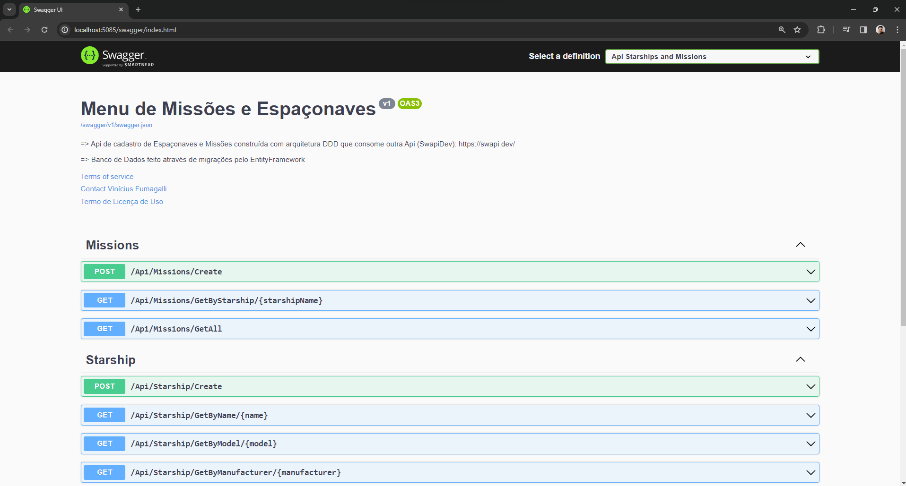

# 🚀 API de Gerenciamento de Frota de Espaçonaves do Universo Star Wars 
API na qual o usuário, para cadastrar uma ou mais espaçonaves de uma vez, informa o modelo e todo o resto das informações dessa(s) espaçonave(s) é obtida através da API [Swapi.Dev](https://swapi.dev/). Ademais, é possível editar e remover cada nave espacial, além de consultá-las por nome, modelo ou fabricante. Há também o registro de missões realizadas por cada espaçonave no qual é possível cadastrar mais de uma nave espacial por missão e consultar todas as missões realizadas por espaçonave. 


## 🌐 Stack Utilizada

**API:** C# - .NET Framework 7.0 - EntityFramework - Swagger (Documentação) 

**Banco de Dados:** SQLServer


## 🧠 Conhecimentos Adquiridos 

- Consumo de outra API
- Deserialização de JSON
- AutoMapper
- Injeção de Dependência
- Migrações pelo Entity Framework
- DTOs (Data Transfer Object)
- Comunicação com Banco de Dados através de Variável de Ambiente

## 📥 Instalação e Uso 

- É necessário ter o .NET 7.0 instalado -> https://dotnet.microsoft.com/pt-br/download/dotnet/7.0
- É necessário conexão com internet durante o uso pois a API consome outra API
- É necessário o uso de SQLServer para o banco de dados
- Recomendo o uso do Visual Studio Code para rodar a aplicação


Clone o projeto

```bash
  git clone https://github.com/vini-fumagalli/api-starship-missions.git
```

Vá até o diretório do projeto

```bash
  cd api-starship-missions
```

Abra o VS Code 

```bash
  code .
```

Builde a aplicação

```bash
  dotnet build
```

Crie a variável de ambiente `DB_CONNECTION_STARSHIP`

```
Data Source=seuLocalhost;Initial Catalog=DB_Starships;Trusted_Connection=True;TrustServerCertificate=true;
```

Aplique as migrações para o Banco de Dados

```bash
  dotnet ef migrations add FirstMigration
  dotnet ef database update 
```

Inicie a aplicação

`pressione (F5)`

O Swagger será renderizado e disponibilizará o uso de cada endpoint da API



Possíveis modelos a serem inseridos pelo usuário e buscados na API Swapi.Dev 👇

```bash
- CR90 corvette
- Imperial I-class Star Destroyer
- Sentinel-class landing craft
- DS-1 Orbital Battle Station
- YT-1300 light freighter
- BTL Y-wing
- T-65 X-wing
- Twin Ion Engine Advanced x1
- Executor-class star dreadnought
- GR-75 medium transport
```
Exemplo de cadastro de espaçonave através do modelo 👇


## 🙋 Autor

- Vinícius Fumagalli
- Estagiário de back-end com .NET
- Cursando 4º período de Ciência da Computação

## 🔗 Links
[](https://github.com/vini-fumagalli)

[](https://www.linkedin.com/in/vin%C3%ADcius-fumagalli-b59313250/)
